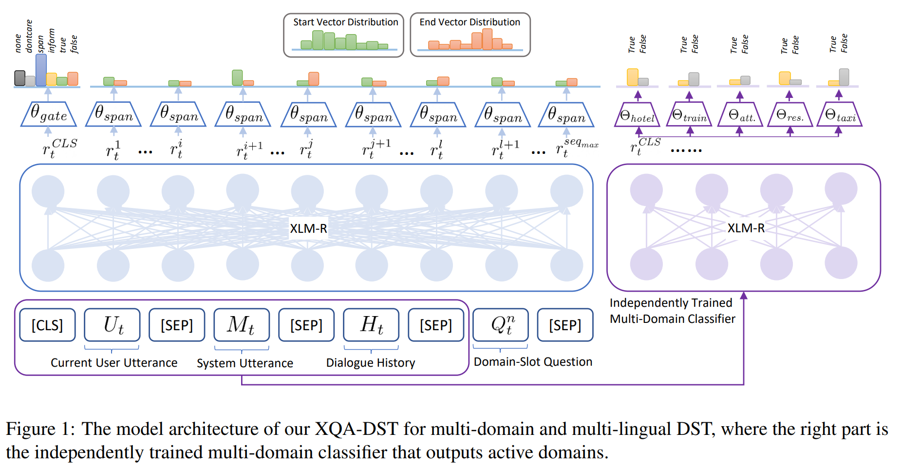

# Code for XQA-DST: Multi-Domain and Multi-Lingual Dialogue State Tracking.

**Link to paper**:
[XQA-DST: Multi-Domain and Multi-Lingual Dialogue State Tracking](https://arxiv.org/abs/2204.05895)
Authors: Han Zhou, Ignacio Iacobacci, Pasquale Minervini

In Findings of the 17th Conference of the European Chapter of the Association for Computational Linguistics (EACL), 2023.

If you find our work to be useful, please cite:
```
@article{zhou2022xqa,
  title={XQA-DST: Multi-Domain and Multi-Lingual Dialogue State Tracking},
  author={Zhou, Han and Iacobacci, Ignacio and Minervini, Pasquale},
  journal={arXiv preprint arXiv:2204.05895},
  year={2022}
}
```
## Dependencies
Install pytorch, transformers, tensorboardX, and Googletrans
```
conda install pytorch torchvision torchaudio pytorch-cuda=11.8 -c pytorch-nightly -c nvidia
pip install transformers==2.9.1
conda install tensorboardX
pip install googletrans==3.1.0a0
```

## XQA-DST Experiments in the paper
### Zero-shot Domain Adaptation Experiments
1. First define the excluded domain in the file ```examples/example.train.xlmr.multiwoz.adaptation```
2. Execute the following script that will do the leave-1-out domain adaptation experiment for you.
```
sh examples/example.train.xlmr.multiwoz.adaptation 
```
### Zero-shot Cross-Lingual Experiments
1. First train the XLM-R on WOZ 2.0 English datasets. We start from the checkpoint of the XLM-R trained on SQuAD 2.0
```
sh examples/example.train.xlmr.squad
```
2. Define the best learned checkpoint in 'model_name_or_path'. Transfer it to GE and IT. Notice the Googletrans process is time-consuming.
```
sh examples/example.test.cross.lingual.it
sh examples/example.test.cross.lingual.de
```
### Supervised DST Experiments
1. We first train the independent domain classifier using files ending with domain_classifier_multiple
```
sh examples/example.train.xlmr.multiwoz.classifier
```
2. Then train the main model independently. 
```
sh examples/example.train.xlmr.multiwoz
```
3. Then load them together within the arguments of the file ```example.test.xlmr.combine```, which should generate evaluation results.
```
sh examples/example.test.xlmr.combine
```
## Datasets
Supported datasets are:
- WOZ 2.0 (see data/)
- MultiWOZ 2.1 (see data/, https://github.com/budzianowski/multiwoz.git)

The prepared and processed datasets for this work is ```'preprocessed_data.zip'```. Please unzip it to the data/ folder for your convenience.

Partial codes are modified from [TripPy: A Triple Copy Strategy for Value Independent Neural Dialog State Tracking](https://www.aclweb.org/anthology/2020.sigdial-1.4/)

## Backlog:
1. Add support for new multi-lingual ToD datasets.
2. Replace the framework to the newest version of Huggingface transformers.

